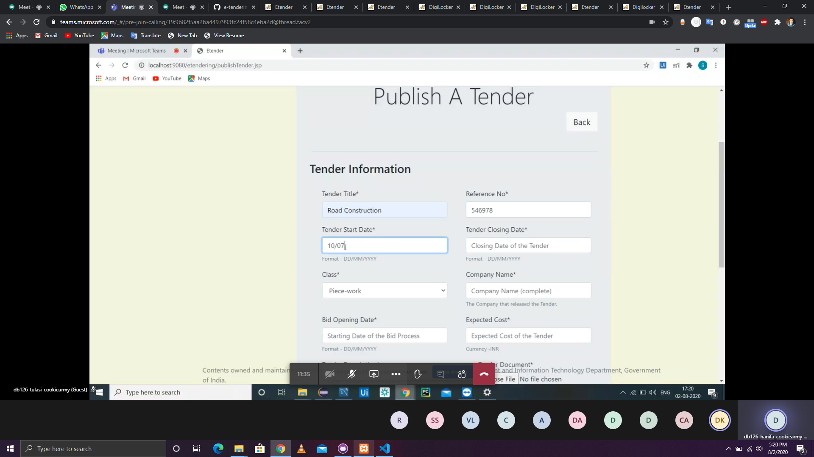

# db126_cookie_army
Smart India Hackathon 2020 (SIH 2020) , Nodal Center - KLU , Andhra Pradesh  

Team Name : Cookie Army  
Team Leader : Fayazuddin Shaik  
Problem Statement Code : db126 ( from Tripura Institute of Technology )  
Nodal Center : KL University , Andhra Pradesh  
Team College : SRKR Engineering College  

Team Members Name: 
Fayazuddin Shaik 
Hanifa Shaik 
Tulasi Devi Siddani 
Sai Sumanth 
Teja Krishna 
Ashutosh Mishra 

ScreenShots

